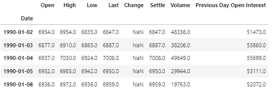
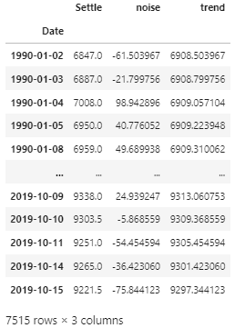

# Timeseries analysis of Japanese Yen Vs US Dollar

In this project we find the Noise and Trend in the data (Settle price of Yen vs US Dollar). We start with getting the data from 1990 onwards, read into a dataframe

Then create and new dataframe from the Settle Column apply Hodrick_Prescott filter to separate Noise and Trend.

