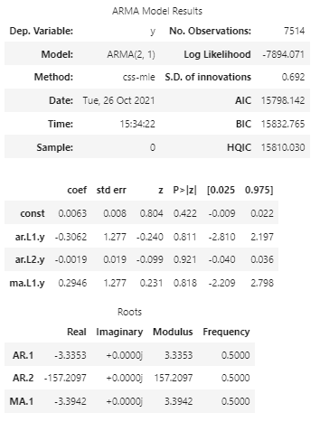

# Timeseries analysis of Japanese Yen Vs US Dollar

In this project we find the Noise and Trend in the data (Settle price of Yen vs US Dollar). We start with getting the data from 1990 onwards, read into a dataframe

Then create and new dataframe from the Settle Column apply Hodrick_Prescott filter to separate Noise and Trend.

Ploted the Settle Price vs. the Trend Price for 2015 to the present

Used library statsmodels for modeling (ARMA and ARIMA)

#### In the ARMA model, using order of p, q as (2, 1) the autoregressive model had a p value .422 that was greater than 0.05(significance level). Which means that the coefficient for the autoregressive model is not statistically significant and should not be kept in the model.

#### In the ARIMA model, using order of p, d, q as (5, 1, 1) the autoregressive model had a p value .65 that was greater than the significance level of 0.05. Which means that the coefficient for the autoregressive model is not statistically significant and should not be kept in the model.

# Linear Regression Model

SKLearn library was used to model linear regression

Using the shift() function we added a Lagged_Retun column and then the data was split into testing and training datasets. Training data was used to train the Linear Regression Model and then tested against the testing data to predict returns

Further, Root Mean Squared Error was calculated for Returns vs Predicted Returns (out of sample) and the in sample data 

Out-of-Sample Root Mean Squared Error (RMSE): 0.4154832784856737

In-sample Root Mean Squared Error (RMSE): 0.5963660785073426

The out-of-sample RMSE of 0.415 is lower than the in-sample RMSE of 0.596. This means the model made better predictions on test data than the actual training data.

